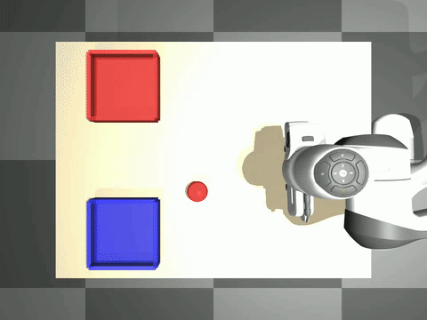
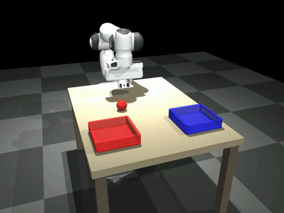

# Panda-VLA-RL

This project explores learning robotic manipulation through the task of color-based object sorting. A Franka Panda arm is trained to pick up colored balls and place them into their matching colored bins — red balls into the red bin, blue balls into the blue bin — entirely in MuJoCo simulation.

The sorting task is deliberately chosen as a structured testbed: it requires the full manipulation pipeline (reaching, grasping, lifting, transporting, placing), scales naturally from 1 to 4 objects, and introduces sequencing challenges that expose the limits of different learning approaches. The project progresses through four stages — state-based RL, vision-based RL with a CNN encoder, vision-based RL with a frozen Vision-Language-Action model, and behavioral cloning — each removing one more source of privileged information and moving closer to a system that could transfer to a real robot. The central question(for now) driving the later stages is whether frozen VLA representations carry enough semantic grounding that language re-prompting alone can enable a policy trained on single-object sorting to generalize to multi-object sorting without any additional training.

---

## Demo

### State SAC — 4 Ball Sorting (100%)


### CNN Vision SAC — 1 Ball (100%)


### Frozen VLM + SAC — 1 Ball (100%)


---

## Results

| Method | 1-ball | 2-ball | 4-ball | Vision-only inference? |
|---|---|---|---|---|
| State SAC + HRL | 100% | 100% | 100% | No |
| CNN + SAC (DrQ) | 100% | ~30% | — | Yes |
| Frozen VLM + SAC | 100% | 30-40% (no re-prompt) | — | Yes |
| Frozen VLM + SAC + re-prompt | 100% | 50-60% (preliminary) | — | Yes |

**Key finding:** A policy trained only on 1-ball episodes generalizes to 2-ball sorting via language re-prompting, with zero multi-object training.

**Design principle:** No privileged state at inference. Ball positions and bin positions are used only for reward shaping during training (asymmetric actor-critic). The deployed policy sees only cameras + language + proprioception.

---

## Architecture Overview

```
Overhead camera (480x640) --+
                             +--> Frozen SigLIP --> 768D --+
Wrist camera (480x640) -----+                              |
                                                           +--> 2503D --> SAC --> 4D action --> OSC --> Panda
Language instruction --> Frozen LLaMA --> 960D ------------+
                                                           |
Proprioception (7D) ---------------------------------------+
```

VLM (SmolVLA, 450M params) is fully frozen. Only the SAC actor/critic (~5.4M params) is trained.

---

## Phase 1: State-Based SAC + Hierarchical RL

The first phase establishes baselines with full state access — ground truth ball positions, bin positions, and sorted flags in the observation. This is not deployable on a real robot but proves the control pipeline works.

### Environment
- Franka Panda in MuJoCo with custom PandaSortEnv
- Task: sort red/blue balls into matching colored bins
- 4D action space: [dx, dy, dz, gripper] in [-1, 1]
- OSC controller built from scratch — runs at physics rate (500Hz), policy at 10Hz
- 51D observation: ee_pos + ee_vel + finger_width + 4 ball slots x 11D

### SAC (1 ball)
Full SAC implementation from scratch: twin critics, squashed Gaussian policy, automatic entropy tuning, LayerNorm stabilization, alpha floor at 0.01 to prevent exploration collapse.

Result: 100% placement, 22-step average episodes

### Hierarchical RL (2 and 4 balls)
Flat SAC cannot sequence multiple objects — proved empirically, plateaued at 35%. Solution: two-level hierarchy.

- High-level: DQN selects which ball to target next (32D compact state obs)
- Low-level: Frozen 1-ball SAC checkpoint executes pick-and-place
- Obs remapping: make_1ball_obs() puts target ball in slot 0, zeros others
- High-level reward: +1 per ball sorted, +5 when all done

Result: 100% on 2-ball and 4-ball


---

## Phase 2: CNN Vision SAC

Removed all privileged state from the policy observation. Ball and bin positions are never given to the policy — only cameras and proprioception. This is the minimum requirement for sim-to-real transfer.

### Architecture
- Overhead camera (68x68 render → 64x64 random crop) + EE-tracking wrist camera
- DualCameraEncoder: two separate CNNs, 128D each → 256D visual features
- With proprioception (7D): 263D input to SAC
- DrQ-style random crop augmentation
- Shared encoder between actor and critic (separate encoders caused Q explosion)
- Staged warmup: critic-only → encoder unfreezes → actor unfreezes

### Results
- 1-ball: 100% at 500K steps
- 2-ball: ~30% — CNN has no mechanism to re-target after first ball sorted

The CNN encodes what it sees but has no semantic understanding of language instructions. It cannot re-target based on a changed task description.


---

## Phase 3: Frozen VLM + SAC

Replaced the CNN encoder with frozen SigLIP + LLaMA from SmolVLA. The VLM is never trained — it acts as a semantically grounded feature extractor. Only the SAC actor/critic learns.

### Architecture
- SigLIP vision encoder: images resized to 384x384, 576 patches x 768D → mean pooled → 768D per camera
- LLaMA text encoder: tokenized instruction (max 48 tokens) → 960D mean pooled
- Concat: vision(1536D) + language(960D) + proprio(7D) = 2503D
- SAC: 512 hidden, 3 layers, LayerNorm, ~5.4M trainable params
- Language embedding cached per task string — no recomputation per step
- Feature extraction: ~115ms/step on MPS (~3.8 SPS)

### 1-Ball Result
100% placement rate, 0% push rate, stable through 200K steps


### 2-Ball (Flat Training)
Direct 2-ball training from 1-ball checkpoint reached 30-40%. Same sequencing failure as CNN — flat SAC cannot re-target after first ball sorted.

---

## Phase 4: Language Re-Prompting (Active)

### The Key Experiment

Ran the frozen 1-ball VLM+SAC on 2-ball episodes in two modes:

| Mode | All sorted | First ball |
|---|---|---|
| Baseline (same task string) | 30% | 70% |
| Re-prompt (switch task after first ball sorted) | 50% | 70% |

Same policy, same weights, same everything — only the task string changes.

After the first ball is sorted:
```
"sort the red ball and blue ball into their matching bins"
        (first ball sorted, re-prompt)
"pick up the blue ball and place it in the blue bin"
```

The policy re-targets the second ball purely from the changed language input. No retraining. No new architecture. The VLM representations are compositionally grounded enough to respond to mid-episode language changes.

### Vision-Based Completion Detection
Re-prompting uses a color pixel mask on the overhead camera image to detect when a ball has been sorted — no state observations at inference. The same cameras available on a real robot.

### Next Steps
- Run 50+ episode eval with honest vision-based detector for final numbers
- SmolVLA behavioral cloning results (training in progress)

---

## In Progress: SmolVLA Behavioral Cloning

Training SmolVLA end-to-end via behavioral cloning as a comparison baseline.

Dataset: 2,853 expert episodes / 183,406 frames
- 1-ball: 996 episodes (SAC oracle, 100% success)
- 2-ball: 974 episodes (HRL oracle, 100% success)
- 4-ball: 883 episodes (HRL oracle, 100% success)
- Cameras: overhead + wrist (480x640), 10Hz
- Language: natural instruction per frame

---

## What's Built From Scratch

| Component | Details |
|---|---|
| PandaSortEnv | Custom Gymnasium env, MuJoCo, 4-ball capable, dense reward shaping |
| OSCController | Operational space control, damped pseudoinverse Jacobian, null-space posture bias, 500Hz |
| SAC | Twin critics, squashed Gaussian, auto entropy tuning, alpha floor, LayerNorm |
| DQN | High-level ball selector, epsilon-greedy, valid action masking, target network |
| DualCameraEncoder | Separate CNNs per camera, DrQ random crop augmentation |
| VLMFeatureExtractor | Frozen SigLIP + LLaMA from SmolVLA, language embedding cache |
| Demo pipeline | 2,853 episodes collected with trained RL oracles |

---

## Setup

```bash
git clone https://github.com/YOUR_USERNAME/panda-vla-rl
cd panda-vla-rl
pip install torch mujoco gymnasium numpy
# For VLM+SAC
pip install -e path/to/lerobot
```

### Train State SAC
```bash
python scripts/train_sac_v2.py --n_balls 1 --total_steps 200000
```

### Train State HRL
```bash
python scripts/train_hrl.py \
    --low_level runs/sac_1ball_new/final_model.pt \
    --n_balls 4
```

### Train CNN Vision SAC
```bash
python scripts/train_vision_sac.py --total_steps 500000
```

### Train Frozen VLM + SAC
```bash
python scripts/train_vlm_sac.py \
    --vlm_checkpoint outputs/train/smolvla_panda_sort_v2/checkpoints/005000/pretrained_model \
    --n_balls 1 \
    --total_steps 200000
```

### Record Videos
```bash
# 1-ball
python scripts/visualize_vlm.py \
    --checkpoint runs/vlm_sac_1ball_seed108/best_model.pt \
    --n_balls 1 --n_episodes 5

# 2-ball with re-prompting
# Might not give the best of the results.
python scripts/visualize_vlm.py \
    --checkpoint runs/vlm_sac_1ball_seed108/best_model.pt \
    --n_balls 2 --reprompt --n_episodes 5
```

### Run Re-Prompt Diagnostic
```bash
python scripts/test_vlm_multiball.py \
    --checkpoint runs/vlm_sac_1ball_seed108/best_model.pt \
    --n_episodes 50
```

---

## Stack

- Python 3.12, PyTorch 2.10.0 (MPS backend)
- MuJoCo 3.4.0
- LeRobot 0.5.1
- SmolVLA (SmolVLM2-500M-Video-Instruct backbone)
- Apple M3 Pro — all training local

---

## Project Status

- [x] State SAC — 1/2/4 ball, 100%
- [x] CNN Vision SAC — 1 ball, 100%
- [x] Frozen VLM + SAC — 1 ball, 100%
- [x] Language re-prompting — 2-ball, 50-60% (preliminary, 10 episodes)
- [ ] Vision-based completion detector (in progress)
- [ ] 50-episode re-prompt eval with honest detector
- [ ] SmolVLA BC results